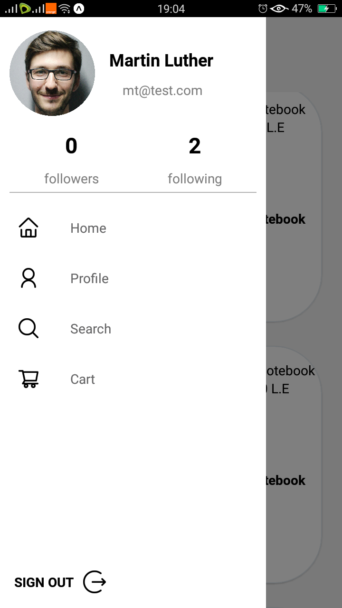

# my-store-React-Native
Finally my-store app is done :)  
My store app is React native project for any one has store or hasn't to show his products and made his store online.  
The project has two interfaces one for store owner and one for the user who wants to buy some thing.  
The project is a social media app but for online stores.

# ScreenShots :
## Salesman interface : 

## Customer user interface :

# Features :
1. Authentication
2. Chat room
3. Search for the products and store owners
4. every store owner have a profile and user can make follow to any store owner
5. store owner can make a post with name , price, description and some photos for the new product 
6. Discover the new products in the timeline page
7. every user in app have a cart page 

# Getting Started
You can clone this repo by running this command git clone on git bash or linux/mac terminal and run npm install in app dir.

# Prerequisites 
To run the app on your device make sure you install node, npm, firebase and expo-cli in your computer.

# Libraries:
1. React Navigation (stack - drawer - bottom tab)
2. React Native elements
3. expo-image-picker
4. React-native-vector-icons
5. firebase (firestore )
6. Redux
7. React-redux
8. Redux-thunk

# Developer
e-mail : emadobito22@gmail.com 
Linkedin : <a href = "https://www.linkedin.com/in/emad-hashem-0967961a7/">Emad Hashem</a>

